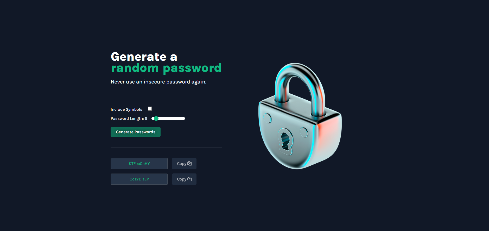

# Password Generator

This is my solution to a solo project at Scrimba [JavaScript course](https://scrimba.com/learn/learnjavascript). I built this project from scratch and added more functionalities than what was asked such as copy on click, optional symbols and determine password length. Hope you guys like it! 🙌🏼

## Table of contents

- [Overview](#overview)
  - [Screenshot](#screenshot)
  - [Links](#links)
- [My process](#my-process)
  - [Built with](#built-with)
  - [What I learned](#what-i-learned)
- [Author](#author)
- [Acknowledgments](#acknowledgments)

## Overview

### Screenshot

#### Desktop

#### Mobile
    > I need to work on its responsiveness

### Links

- Solution URL: [Link](https://github.com/amir-the6th/Password-Generator)
- Live Site URL: [Link](https://effortless-granita-6bac0c.netlify.app)

## My process

### Built with

- HTML5 markup
- Pure CSS
- Vanilla JavaScript

### What I learned

I occurred many difficulties throughout the project, including:
- Configuring the copy-on-click button: I was displaying the password in a <code>
</code> element and Clipboard API kind of only welcomes <code><input></code> & <code><textarea></code>. It took me a while to understand this and set everything again.
- I wanted to display the characters array in another file and import it in the *index.js* file. But that didn't turn out well because in order to do that, your js file should be of type *module*; and when I set the type, the <code>onclick()</code> event caused me problems. I tried to used <code>.addEventListener</code> to fix the problem, but then another issue happened in the copyOnClick() where the caught error stated that "Document is not focused!"

Overall, I really enjoyed my time working on this project. It made me realize a simple-looking task can become pretty complex when you try to add more functionalities to it.

## Author

- Website - [Amir Sabagh](https://arsenicolos.com)
- GitHub - [@amir-the6th](https://github.com/amir-the6th)
- LinkedIn - [Amir Sabagh](https://linkedin.com/in/arsenicolos)

## Acknowledgments

I want to give a shout-out to the [Scrimba](https://scrimba.com) CEO and professor, Per Harald Borgen([@perborgen](https://github.com/perborgen)). I recently finished the [HTML and CSS course](https://scrimba.com/learn/htmlandcss) on Scrimba and am currently doing the follow-up course, [Learn JavaScript for Free](https://scrimba.com/learn/learnjavascript).